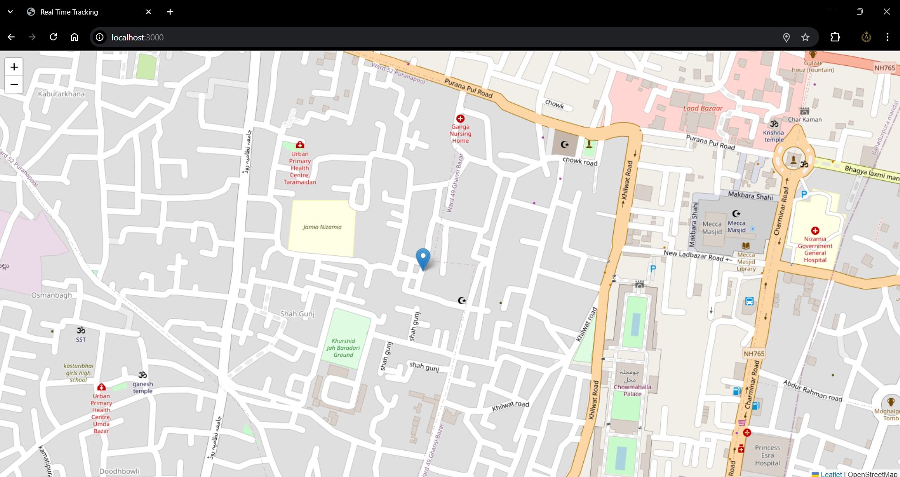

# Live Location Tracking

A simple Node.js application for real-time device location tracking using [Express](https://expressjs.com/), [Socket.IO](https://socket.io/), and [Leaflet](https://leafletjs.com/).



## Features

- Tracks and displays the real-time location of connected users on a map
- Uses browser geolocation API
- Shows all users' locations with markers
- Map centers on your own location

## Getting Started

### Prerequisites

- [Node.js](https://nodejs.org/) installed

### Installation

1. Clone the repository:
   ```
   git clone https://github.com/yourusername/live-location-tracking.git
   cd live-location-tracking
   ```

2. Install dependencies:
   ```
   npm install
   ```

### Running the App

Start the server:
```
npm start
```

Open your browser and go to [http://localhost:3000](http://localhost:3000)

## Usage

- Allow location access in your browser when prompted.
- Your location will appear on the map.
- Open the app on multiple devices/browsers to see real-time tracking.
